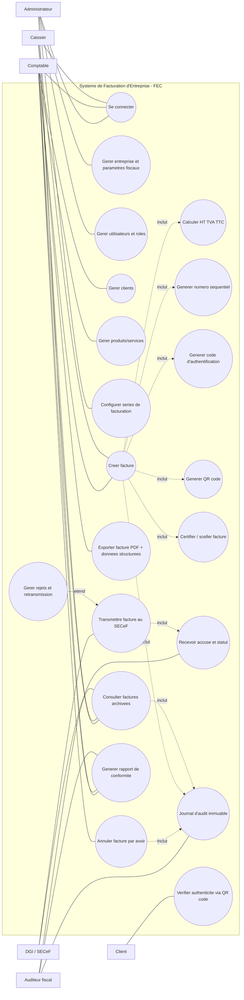
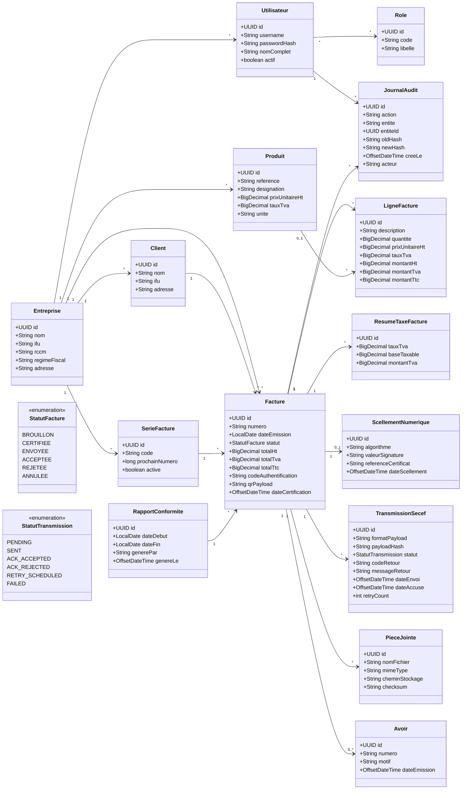
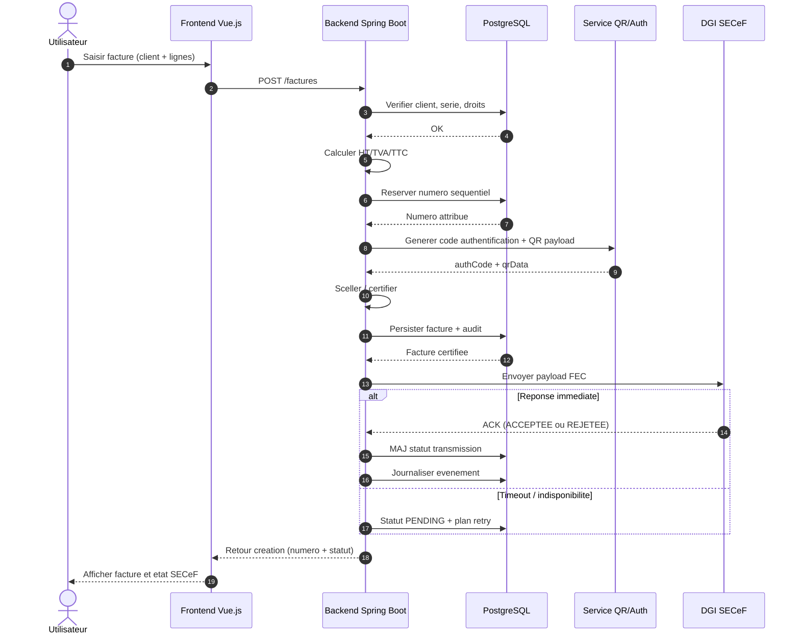
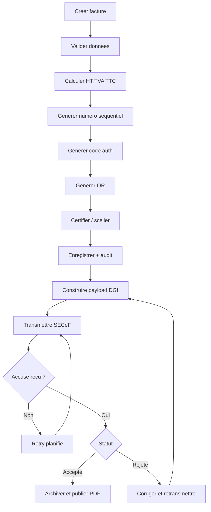
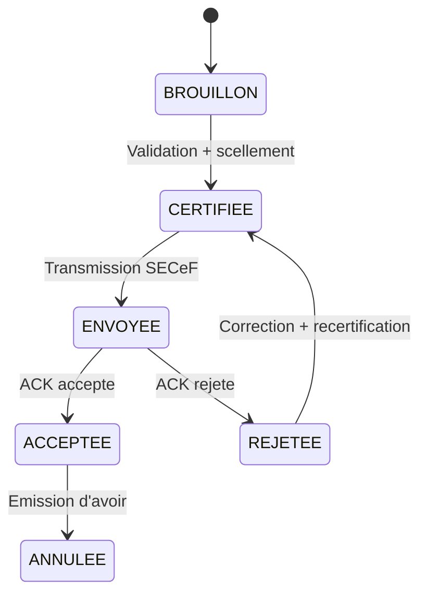
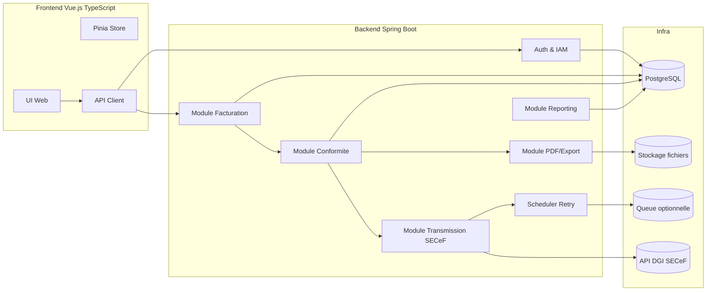
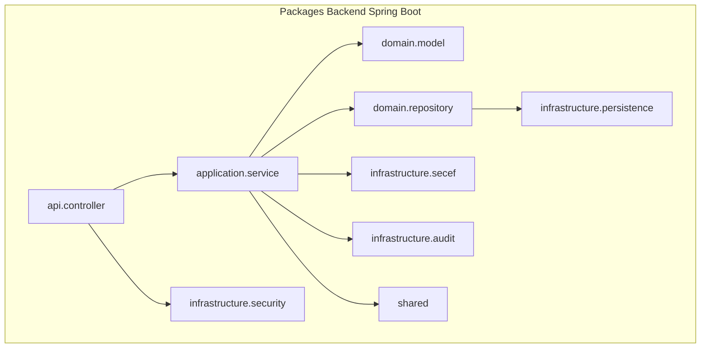

# Documentation UML - SFE FEC Burkina (Spring Boot + Vue.js TypeScript)

Version: 1.1  
Date: 2026-04-10  
Portee: Phase 1 (conformite fiscale FEC)

## 1. Objectif du document

Ce document centralise la conception fonctionnelle et technique du Systeme de Facturation d'Entreprise (SFE) conforme a la Facture Electronique Certifiee (FEC) au Burkina Faso.

Il couvre les diagrammes suivants:

1. Diagramme de cas d'utilisation
2. Diagramme de classes
3. Diagramme de sequence
4. Diagramme de flux (activite)
5. Diagramme d'etats
6. Diagramme de composants
7. Diagramme de packages
8. Diagramme de deploiement

## 2. Contexte et principes

Le systeme doit prioriser la conformite fiscale avant les modules metier avances.

Principes directeurs:

1. Integrite des factures
2. Tracabilite complete (audit immuable)
3. Numerotation sequentielle non modifiable
4. Generation code authentification + QR
5. Transmission SECeF + gestion des statuts
6. Archivage fiscal et preuve de conformite

## 3. Acteurs metier

1. Administrateur: parametre l'entreprise, les roles, les series et la conformite.
2. Comptable: gere clients, produits, creation facture, avoirs et suivi.
3. Caissier: cree des factures selon les droits accordes.
4. Client: verifie l'authenticite d'une facture via QR.
5. DGI / SECeF: recoit, valide ou rejette les factures transmises.
6. Auditeur fiscal: consulte archive, audit et rapports de conformite.

## 4. Diagramme de cas d'utilisation



### Documentation detaillee du diagramme de cas d'utilisation

#### 4.1 Objectif

Decrire qui fait quoi dans le systeme, et identifier les fonctionnalites obligatoires pour la conformite FEC.

#### 4.2 Frontiere fonctionnelle

Le diagramme couvre uniquement la Phase 1 (conformite fiscale):

1. gestion des donnees de base,
2. emission de facture certifiee,
3. transmission fiscale,
4. controle et archivage.

#### 4.3 Cas d'utilisation critiques

1. `Creer facture` est le cas principal.
2. `Transmettre facture au SECeF` et `Recevoir accuse et statut` sont obligatoires pour qu'une facture soit fiscalement exploitable.
3. `Journal d'audit immuable` est transversal et lie aux actions sensibles.
4. `Annuler facture par avoir` remplace toute suppression physique de facture.

#### 4.4 Regles metier associees

1. Une facture certifiee ne peut pas etre supprimee.
2. Toute action de creation, correction, annulation, consultation est historisee.
3. Seuls les profils autorises peuvent certifier, transmettre ou annuler.
4. Un rejet DGI doit produire un flux de correction et retransmission.

#### 4.5 Pre-conditions et post-conditions

1. Pre-conditions de `Creer facture`:
  a. utilisateur authentifie,
  b. serie active,
  c. client valide.
2. Post-conditions de `Creer facture`:
  a. numero attribue,
  b. code auth + QR generes,
  c. trace d'audit creee.
3. Post-conditions de `Transmettre facture au SECeF`:
  a. statut de transmission mis a jour,
  b. accuse stocke,
  c. eventuel retry planifie.

## 5. Diagramme de classes



### Documentation detaillee du diagramme de classes

#### 5.1 Objectif

Structurer les donnees metier et techniques qui garantissent la conformite fiscale, la tracabilite et l'integrite des factures.

#### 5.2 Regles de modelisation

1. `Facture` est l'agregat central.
2. Les objets de preuve (`ScellementNumerique`, `JournalAudit`, `TransmissionSecef`) sont separes pour assurer la lisibilite et l'auditabilite.
3. Les statuts sont portes par des enums pour verrouiller les transitions autorisees.

#### 5.3 Documentation classe par classe

| Classe | Role metier | Attributs critiques | Contraintes principales |
|---|---|---|---|
| `Entreprise` | Porte les informations legales du contribuable | `ifu`, `rccm`, `regimeFiscal` | Une entreprise active doit avoir ses identifiants fiscaux valides |
| `Utilisateur` | Acteur applicatif authentifie | `username`, `passwordHash`, `actif` | `username` unique, compte inactif interdit en production de facture |
| `Role` | Definit les permissions metier | `code`, `libelle` | Le role controle l'acces aux cas sensibles (certification, annulation) |
| `Client` | Tiers facture | `nom`, `ifu`, `adresse` | Les champs obligatoires dependent des exigences DGI |
| `Produit` | Article ou service facture | `reference`, `prixUnitaireHt`, `tauxTva` | `tauxTva` dans la grille fiscale autorisee |
| `SerieFacture` | Source de numerotation | `code`, `prochainNumero`, `active` | Sequence strictement croissante, non reutilisable |
| `Facture` | Document fiscal principal | `numero`, `dateEmission`, `totalTtc`, `codeAuthentification`, `statut` | `numero` unique par serie, immutabilite apres certification |
| `LigneFacture` | Detail de facturation | `quantite`, `prixUnitaireHt`, `montantTtc` | Montants recalcules par le backend, jamais saisis en confiance |
| `ResumeTaxeFacture` | Synthese TVA par taux | `tauxTva`, `baseTaxable`, `montantTva` | Coherence obligatoire avec la somme des lignes |
| `Avoir` | Annulation/regulation legale | `numero`, `motif`, `dateEmission` | Lie a une facture de reference, pas de suppression de la facture source |
| `ScellementNumerique` | Preuve d'integrite cryptographique | `algorithme`, `valeurSignature`, `dateScellement` | Signature produite apres gel des donnees facture |
| `JournalAudit` | Trace inviolable des actions | `action`, `entite`, `oldHash`, `newHash`, `acteur` | Ecriture append-only, horodatage fiable |
| `TransmissionSecef` | Historique des echanges DGI | `payloadHash`, `statut`, `codeRetour`, `retryCount` | Chaque tentative est conservee, meme en echec |
| `RapportConformite` | Support de controle fiscal | `dateDebut`, `dateFin`, `genereLe` | Reproductible a periode donnee |
| `PieceJointe` | Artefacts associes (PDF, exports) | `nomFichier`, `checksum`, `cheminStockage` | Integrite controlee par checksum |

#### 5.4 Documentation des relations critiques

1. `Facture` 1..* `LigneFacture`: une facture a au moins une ligne.
2. `Facture` 1..* `TransmissionSecef`: plusieurs envois possibles (retry).
3. `Facture` 1..* `JournalAudit`: toute evolution laisse une preuve.
4. `Facture` 0..* `Avoir`: plusieurs regularisations possibles selon les regles metier.
5. `SerieFacture` 1..* `Facture`: sequence geree au niveau serie.

#### 5.5 Invariants metier a appliquer en code

1. Somme(`LigneFacture.montantTtc`) = `Facture.totalTtc`.
2. `Facture.statut = CERTIFIEE` implique `codeAuthentification` non vide.
3. `Facture.statut = ENVOYEE` implique au moins une `TransmissionSecef`.
4. Une transition vers `ANNULEE` exige un `Avoir` valide.

## 6. Diagramme de sequence (scenario nominal)



### Documentation detaillee du diagramme de sequence

#### 6.1 Objectif

Decrire l'ordre exact des interactions entre utilisateur, frontend, backend, base de donnees, service QR/Auth et SECeF.

#### 6.2 Lecture pas a pas

1. L'utilisateur saisit la facture sur le frontend.
2. Le frontend appelle `POST /factures`.
3. Le backend valide les pre-conditions (droits, client, serie).
4. Le backend calcule les montants et reserve le numero.
5. Le backend genere code d'authentification et payload QR.
6. Le backend certifie, persiste puis transmet au SECeF.
7. Le backend traite l'ACK ou planifie un retry.
8. Le frontend recoit le statut et l'affiche.

#### 6.3 Points de controle techniques

1. Transaction DB sur creation facture + audit.
2. Idempotence de l'envoi SECeF pour eviter les doublons.
3. Journalisation des erreurs de transport et de validation DGI.
4. Retry avec backoff et plafond de tentatives.

#### 6.4 Gestion d'erreurs

1. Erreur metier avant certification: la facture reste non certifiee.
2. Erreur de transport SECeF: statut `PENDING` puis retry.
3. Rejet DGI: statut `REJETEE` avec motif conserve.

## 7. Diagramme de flux (activite metier)



### Documentation detaillee du diagramme de flux

#### 7.1 Objectif

Representer le processus metier complet de la facture certifiee, depuis la saisie jusqu'au statut fiscal final.

#### 7.2 Etapes du flux

1. Preparation: saisie et validation des donnees.
2. Production fiscale: calcul, numerotation, code auth, QR, certification.
3. Transmission: construction payload et envoi SECeF.
4. Resolution: accepte, rejete ou retry.
5. Finalisation: archivage et mise a disposition controle.

#### 7.3 Branches conditionnelles

1. `ACK non recu`: branche de retry technique.
2. `ACK recu + rejete`: branche de correction metier.
3. `ACK recu + accepte`: branche de finalisation fiscale.

#### 7.4 Livrables produits par le flux

1. Facture certifiee et numerotee.
2. Traces d'audit.
3. Historique de transmissions.
4. PDF et donnees structurees archivees.

## 8. Diagramme d'etats de la facture



### Documentation detaillee du diagramme d'etats

#### 8.1 Objectif

Formaliser les transitions autorisees de l'objet `Facture` pour eviter les etats incoherents.

#### 8.2 Definition des etats

1. `BROUILLON`: facture editable, non certifiee.
2. `CERTIFIEE`: facture gelee, signee, prete a transmettre.
3. `ENVOYEE`: payload transmis, attente ou traitement ACK.
4. `ACCEPTEE`: validee par le SECeF.
5. `REJETEE`: refusee par le SECeF (motif obligatoire).
6. `ANNULEE`: regularisee legalement par avoir.

#### 8.3 Regles de transition

1. Interdiction de retour vers `BROUILLON` apres `CERTIFIEE`.
2. Transition `REJETEE -> CERTIFIEE` uniquement apres correction et recertification.
3. Transition `ACCEPTEE -> ANNULEE` uniquement via emission d'avoir.

#### 8.4 Controles d'implementation

1. Verifier les transitions dans la couche service, pas seulement dans l'UI.
2. Enregistrer chaque transition dans `JournalAudit`.
3. Bloquer les actions incompatibles selon le statut courant.

## 9. Diagramme de composants



### Documentation detaillee du diagramme de composants

#### 9.1 Objectif

Montrer la decomposition applicative en blocs fonctionnels deployables et testables separement.

#### 9.2 Responsabilite de chaque composant

1. `UI Web`: saisie, consultation, validation de surface.
2. `API Client`: orchestration des appels backend.
3. `Auth & IAM`: authentification, autorisation, roles.
4. `Module Facturation`: creation facture, lignes, calculs.
5. `Module Conformite`: numerotation, code auth, QR, scellement, audit.
6. `Module Transmission SECeF`: mapping payload, appel API DGI, traitement ACK.
7. `Module Reporting`: extraction conformite et controle fiscal.
8. `Module PDF/Export`: generation document imprimable et export structure.
9. `Scheduler Retry`: reexecution des transmissions en echec.

#### 9.3 Contrats d'integration internes

1. `Facturation -> Conformite`: facture calculee et validee.
2. `Conformite -> Transmission`: payload fiscal signe et hash.
3. `Transmission -> Reporting`: statuts et codes retour normalises.

#### 9.4 Exigences non fonctionnelles par composant

1. `Transmission`: resilience et observabilite.
2. `Conformite`: integrite et non-repudiation.
3. `Reporting`: reproductibilite des extractions.

## 10. Diagramme de packages



### Documentation detaillee du diagramme de packages

#### 10.1 Objectif

Definir l'architecture logique du code backend pour garantir maintenabilite, testabilite et evolution.

#### 10.2 Description des packages

1. `api.controller`: expose les endpoints REST, mappe request/response.
2. `application.service`: porte les cas d'usage et regles applicatives.
3. `domain.model`: objets metier, enums, invariants de domaine.
4. `domain.repository`: contrats de persistence abstraits.
5. `infrastructure.persistence`: implementations JPA/SQL.
6. `infrastructure.secef`: connecteur externe DGI.
7. `infrastructure.security`: JWT, ACL, filtres securite.
8. `infrastructure.audit`: append-only logging et trace technique.
9. `shared`: utilitaires transverses, erreurs communes, types partages.

#### 10.3 Regles de dependance

1. `domain` ne depend d'aucun package infrastructure.
2. `application` depend de `domain`, jamais de details techniques directs.
3. `controller` ne contient pas de logique metier.
4. Les adapters externes sont remplaçables sans casser le domaine.

## 11. Diagramme de deploiement

```mermaid
flowchart LR
  subgraph PosteClient[Poste Client]
    BROWSER[Navigateur Web]
  end

  subgraph DMZ[Zone Applicative]
    LB[Reverse Proxy / Load Balancer]
    WEB[Frontend Vue.js (Nginx)]
    API1[Spring Boot API - Instance 1]
    API2[Spring Boot API - Instance 2]
    WORKER[Worker Retry/Transmission]
  end

  subgraph Data[Zone Donnees]
    PG[(PostgreSQL)]
    FS[(Stockage PDF/exports)]
    REDIS[(Redis/Queue optionnelle)]
  end

  subgraph Externe[Systemes Externes]
    DGI[(SECeF DGI API)]
    SMTP[(SMTP / Notifications)]
  end

  BROWSER --> LB
  LB --> WEB
  LB --> API1
  LB --> API2

  API1 --> PG
  API2 --> PG
  API1 --> FS
  API2 --> FS
  API1 --> REDIS
  API2 --> REDIS
  WORKER --> REDIS
  WORKER --> PG
  WORKER --> DGI

  API1 --> DGI
  API2 --> DGI
  API1 --> SMTP
  API2 --> SMTP
```

### Documentation detaillee du diagramme de deploiement

#### 11.1 Objectif

Definir le mode de mise en production, la separation des zones et les flux reseau critiques.

#### 11.2 Noeuds de deploiement

1. `Navigateur`: point d'entree utilisateur.
2. `Reverse Proxy / Load Balancer`: routage, TLS termination, protection perimetrique.
3. `Frontend Nginx`: diffusion des assets Vue.js.
4. `API Spring Boot (N instances)`: execution des cas metier.
5. `Worker`: retry transmissions, traitements differes.
6. `PostgreSQL`: persistance transactionnelle et audit.
7. `Stockage fichiers`: PDF, exports, artefacts.
8. `Redis/Queue`: file d'attente technique.
9. `SECeF DGI`: systeme fiscal externe.
10. `SMTP`: notification et communication sortante.

#### 11.3 Flux reseau a securiser en priorite

1. Client -> LB (HTTPS).
2. LB -> API (reseau prive ou mTLS selon contexte).
3. API/Worker -> SECeF (TLS + authentification forte).
4. API -> DB (chiffrement en transit).

#### 11.4 Exigences d'exploitation

1. Supervision centralisee (logs, metrics, traces).
2. Sauvegarde DB et restauration testee.
3. Rotation des secrets et certificats.
4. Plan de reprise en cas d'indisponibilite SECeF.

## 12. Regles de conformite transverses

1. Aucune suppression physique de facture certifiee.
2. Toute modification est historisee dans `JournalAudit`.
3. Horodatage fiable obligatoire pour tous les evenements fiscaux.
4. Les payloads transmis et recus doivent etre hashes et conserves.
5. Les erreurs de transmission doivent etre rejouees avec politique de retry.

## 13. Exigences de securite

1. Authentification forte et gestion des roles.
2. Chiffrement TLS en transit.
3. Chiffrement des secrets (cles, certificats, credentials).
4. Journalisation securisee avec retention definie.
5. Sauvegarde et restauration testees periodiquement.

## 14. Livrables de conception associes

1. Ce document UML consolide.
2. Dictionnaire de donnees des entites principales.
3. Contrats API REST (OpenAPI).
4. Strategie de tests (unitaires, integration, conformite).
5. Plan de preparation homologation DGI.

## 15. Prochaines etapes recommandees

1. Valider ce document avec les parties metier et fiscales.
2. Deriver le backlog technique Sprint 1 a Sprint 3.
3. Rediger les schemas SQL initiaux et scripts de migration.
4. Definir le contrat d'integration SECeF (endpoints, formats, securite).
5. Mettre en place la chaine CI/CD et les tests automatiques.
